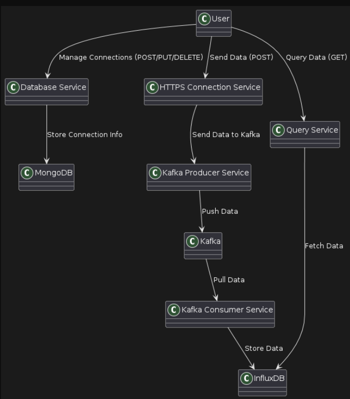

# Event-Driven Application

This project is an example of a microservices architecture for managing HTTPS connections. It includes the following microservices:

1. **Database Service**: Manages connections.
2. **HTTPS Connection Service**: Handles HTTPS connections and receives data.
3. **Kafka Consumer Service**: Consumes data from Kafka and stores it in InfluxDB.
4. **Query Service**: Queries data from InfluxDB based on time range and data name.

## Architecture Diagram

